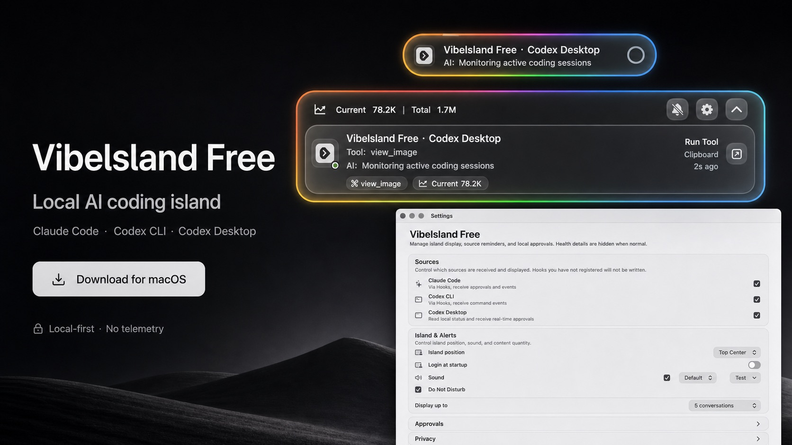

# Vibelsland Free

<p align="center">
  
</p>

<p align="center">
  <a href="README.md">中文</a> | <a href="README.en.md">English</a> | <a href="README.ja.md">日本語</a>
</p>

<p align="center">
  <strong>A local-first AI coding status display for macOS.</strong>
</p>

<p align="center">
  <a href="https://shinteni.github.io/prompt-island/">Website</a>
  ·
  <a href="https://github.com/shinteni/prompt-island/releases/download/v0.2.0/Vibelsland-Free-0.2.0-macos.zip">Download v0.2.0</a>
  ·
  <a href="https://shinteni.github.io/prompt-island/en/install.html">Install &amp; Trust</a>
  ·
  <a href="PRIVACY.md">Privacy</a>
  ·
  <a href="#build-from-source">Build from source</a>
</p>

<p align="center">
  
</p>

`macOS 14+` `Swift` `Local-first` `No telemetry` `Claude Code` `Codex CLI` `Codex Desktop`

## See AI Coding Work At A Glance

Vibelsland Free is a native macOS utility for developers who work with AI coding tools every day. It brings local Claude Code, Codex CLI, and Codex Desktop session status, tool activity, token summaries, and approval requests into one floating island at the top of your screen.

It keeps the most important AI coding state visible while you work. When idle, it stays quiet. During a task, it becomes a compact pill. When an approval request or important update needs attention, it expands into a panel.

## Highlights

- **Floating island UI**: hidden when idle, compact task pill while work is active, and expandable session panel when attention is needed.
- **RGB status glow**: the edge glow is the core visual signature for running, completed, failed, and approval states.
- **Unified AI coding view**: supports Claude Code, Codex CLI, and Codex Desktop in one place.
- **Session summaries**: shows task titles, tool activity, AI response snippets, token usage, and recent updates.
- **Approval center**: respond to allow, reject, continue, or cancel requests from the island.
- **Health dashboard**: check Bridge, Hooks, Codex Desktop connectivity, logs, and local runtime state from settings.
- **Local-first privacy**: no account, no telemetry upload, no cloud sync, and no remote service required for core features.

## Who It Is For

- Developers who run Claude Code, Codex CLI, or Codex Desktop during daily work.
- People who want AI task status visible without switching windows.
- Users who want approvals, tool calls, and session progress in a single macOS-native surface.
- Anyone who prefers quiet, local, low-friction tools.

## Technical Architecture

Vibelsland Free is a Swift Package based native macOS app. The interface combines SwiftUI and AppKit for the menu bar item, floating island panel, and settings window. Core behavior lives in `Sources/VibelslandFreeCore`, where session parsing, approval mapping, deduplication, presentation policy, restart recovery, and health checks are split into testable policy modules.

The local data flow is: Claude Code / Codex CLI hooks and Codex Desktop local state enter the bridge and readers, are normalized into `AgentEvent` / `AgentSession`, and then `SessionStore` drives the top-of-screen island. Runtime communication uses local files, a Unix socket, and local configuration only; no account or remote service is required.

## Verification Strategy

The repository includes Swift unit tests, release packaging scripts, documentation-site checks, and macOS window automation checks. The common entry points are `zsh scripts/run-tests.sh`, `zsh scripts/verify-docs-site.sh`, and `zsh scripts/verify-release-readiness.sh`. GitHub Actions runs Swift build and tests for source, test, and package changes; on a local CommandLineTools-only setup, `scripts/run-tests.sh` explicitly falls back to test-target compilation/discovery. Documentation changes deploy and verify GitHub Pages.

## Download And Install

Download v0.2.0 from GitHub Releases. This release uses ad-hoc signing, so read the install and trust notes before first launch:

[Download v0.2.0](https://github.com/shinteni/prompt-island/releases/download/v0.2.0/Vibelsland-Free-0.2.0-macos.zip)

[Install & Trust](https://shinteni.github.io/prompt-island/en/install.html)

Verify the download:

```sh
curl -LO https://github.com/shinteni/prompt-island/releases/download/v0.2.0/Vibelsland-Free-0.2.0-macos.zip
curl -LO https://github.com/shinteni/prompt-island/releases/download/v0.2.0/Vibelsland-Free-0.2.0-macos.zip.sha256
shasum -a 256 -c Vibelsland-Free-0.2.0-macos.zip.sha256
```

Current SHA-256:

```text
ce3ce10b8ba7b0e388962d660c5c416cd6c246405462c2a578be46aeadd3fab4
```

Install:

1. Download `Vibelsland-Free-0.2.0-macos.zip`.
2. Unzip it and move `>_ - island.app` to `Applications`.
3. Open the app and install Hooks from the menu bar or settings window.
4. Configure launch at login, sound, Do Not Disturb, and display position as needed.

Or install with Homebrew (this repository doubles as a tap; the cask version and SHA-256 are generated from `docs/release.json`):

```sh
brew tap shinteni/island https://github.com/shinteni/prompt-island.git
brew install --cask shinteni/island/vibelsland-free
```

Note: the current free release uses ad-hoc codesign, so first launch requires the Gatekeeper confirmation above. Developer ID signing and notarization can reduce first-launch friction in a future distribution path, but the current v0.2.0 download, checksum, source, and install notes are public.

## Privacy

Vibelsland Free is local-first. It does not create an account, upload telemetry, or sync data to a remote server. It reads local Claude Code, Codex CLI, and Codex Desktop state only to display session status, tool activity, token summaries, and approval requests.

Read the full privacy note in [PRIVACY.md](PRIVACY.md).

## Build From Source

```sh
swift build
zsh scripts/run-tests.sh
zsh scripts/package-release.sh
```

`scripts/package-release.sh` reads package names and app identity from [docs/release.json](docs/release.json) when it creates the local zip and `.sha256` file. If a fresh local package has a different hash than `docs/release.json`, the script labels it as an unpublished candidate; do not update the website checksum alone. Upload the matching GitHub Release assets and update metadata together. To check the current local `dist/` against the public release, run:

```sh
VIBELSLAND_VERIFY_DIST=1 zsh scripts/verify-docs-site.sh
VIBELSLAND_VERIFY_DIST=1 zsh scripts/verify-docs-live.sh
```

Maintainer publishing, custom-domain builds, and release gates are tracked in [MAINTAINER_RELEASE_CHECKLIST.md](MAINTAINER_RELEASE_CHECKLIST.md).

Note: the repository originally used `prompt-island` as its repository name. The current product name is Vibelsland Free, and the app bundle is shown as `>_ - island.app`.

## Project Status

Vibelsland Free v0.2.0 already includes the downloadable local app experience: floating island UI, settings, hook installation, approval UI, runtime health checks, single-instance protection, restart recovery, and release packaging scripts. The current free release uses ad-hoc signing and provides public download, SHA-256 verification, source, install notes, and support entry points.

## License

Vibelsland Free is open source under the [MIT License](LICENSE).

## Independence

Vibelsland Free is an independent utility. It is not affiliated with Anthropic, OpenAI, Claude, or Codex. Product names are used only to describe local compatibility.
