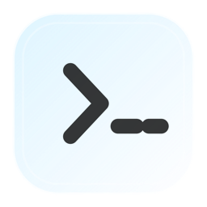
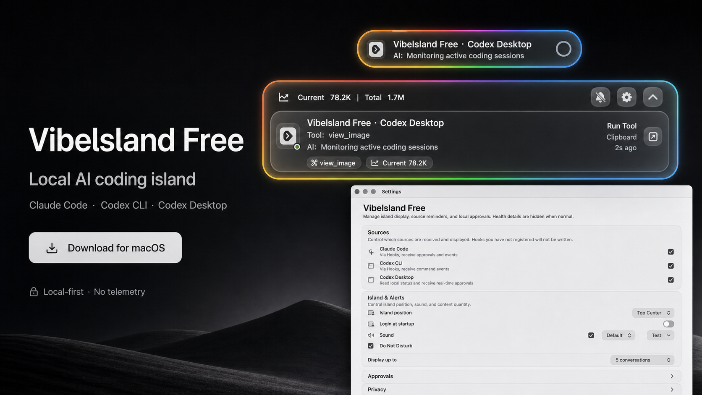

# &gt;_ - island

<p align="center">
  
</p>

<p align="center">
  <a href="README.md">中文</a> | <a href="README.en.md">English</a>
</p>

<p align="center">
  <strong>面向 macOS 的本地 AI 编程浮岛。</strong>
</p>

<p align="center">
  <a href="https://github.com/shinteni/prompt-island/releases/latest">下载最新版</a>
  ·
  <a href="PRIVACY.md">隐私说明</a>
  ·
  <a href="#从源码构建">从源码构建</a>
</p>

<p align="center">
  
</p>

`macOS 14+` `Swift` `Local-first` `No telemetry` `Claude Code` `Codex CLI` `Codex Desktop`

## 一眼看清 AI 编程现场

&gt;_ - island 是给重度 AI 编程用户的 macOS 原生工具。它把 Claude Code、Codex CLI 和 Codex Desktop 的本机会话状态、工具调用、token 摘要和审批请求集中到屏幕顶部的浮岛里。

它不是替代终端或桌面客户端，而是在你工作时把最重要的 AI 编程状态留在视线范围内。空闲时它安静收起，任务进行时变成紧凑药丸，遇到审批或重要状态时展开为面板。

## 产品亮点

- **顶部浮岛**：空闲小圆点、任务药丸、展开面板三种形态，适合常驻屏幕顶部。
- **RGB 光环状态感**：边缘动态光环是核心视觉识别，让运行、完成、失败和审批状态更容易感知。
- **多工具统一视图**：同时覆盖 Claude Code、Codex CLI 和 Codex Desktop，减少反复切换窗口。
- **会话进度摘要**：展示任务标题、工具调用、AI 回复摘要、token 用量和最近活动。
- **审批集中处理**：在浮岛中处理允许、拒绝、继续、取消等审批动作。
- **健康检查中心**：在设置页查看 Bridge、Hooks、Codex Desktop 连接、日志和本机运行状态。
- **本地优先**：不需要账号，不上传遥测，不依赖云端同步，核心功能都在本机完成。

## 适合谁

- 经常同时使用 Claude Code、Codex CLI 或 Codex Desktop 的开发者。
- 希望不切窗口就能看见 AI 编程状态的人。
- 想把审批请求、工具调用和会话进度放到一个可见位置的人。
- 偏好本地工具、低干扰 UI 和 macOS 原生体验的人。

## 下载与安装

最新版可以在 GitHub Releases 下载：

[Download latest release](https://github.com/shinteni/prompt-island/releases/latest)

安装方式：

1. 下载 `prompt-island-0.1.0-macos.zip`。
2. 解压后将 `>_ - island.app` 拖到 `Applications`。
3. 打开应用，在菜单栏或设置页安装 Hooks。
4. 按需开启自动启动、声音、勿扰和显示位置。

说明：当前发布包使用 ad-hoc codesign。面向更大范围分发时，建议使用 Developer ID 签名和 notarization，以获得更顺滑的首次打开体验。

## 隐私

&gt;_ - island 是本机工具，不创建账号，不上传遥测，不同步远程服务器。它只读取 Claude Code、Codex CLI 和 Codex Desktop 在本机留下的状态、会话和审批信息，用于展示浮岛状态。

更多细节见 [PRIVACY.md](PRIVACY.md)。

## 从源码构建

```sh
swift build
swift test
zsh scripts/package-release.sh
```

本地打包产物会生成在：

```text
dist/>_ - island.app
dist/prompt-island-0.1.0-macos.zip
dist/prompt-island-0.1.0-macos.zip.sha256
```

## 项目状态

&gt;_ - island 已经具备可运行的本机版本，包含浮岛展示、设置页、Hook 安装、审批窗口、运行状态检查、单实例保护、重启恢复和发布打包脚本。公开分发前仍建议完成真实设备回归、正式签名和 notarization。

## 许可证

&gt;_ - island 使用 [MIT License](LICENSE) 开源。

## 独立声明

&gt;_ - island 是独立工具，不隶属于 Anthropic、OpenAI、Claude 或 Codex。相关产品名仅用于说明本地兼容性。
